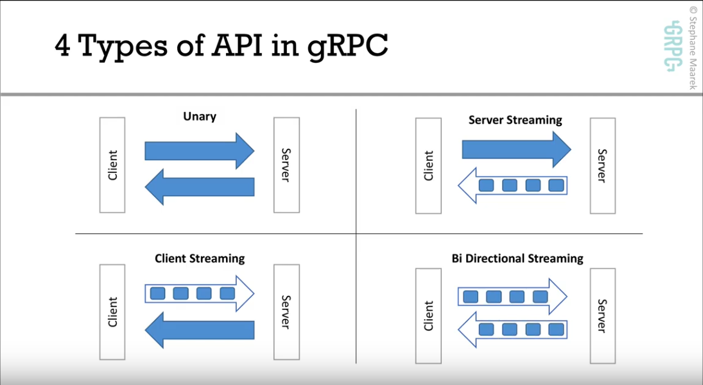

## Vue.js and Express.js

Installation of vue.js from the vue website is more successful than following the linkedIn tutorial in my opinion due to issues with the dependancies not showing in my module folder and in the package.json. Quite possibly in the wrong folder now that I think about it. After several hours of failure I decided to delete that repo and folder and start over following a vue.js tutorial online. Installation of dependancies appeared where they should be and I am unsure what I had done differently apart from following two different tutorials that should not have lead to two different outcomes.

Vue.js is simillar to React in some aspects not that I am all that familliar with React, having only just been introduced to the popular React 8mths ago and due to our experience with React last semester vue.js has not been too difficult to get my headaround and if I'm not mistaken vue.js appears easier or is it this v-bind, v-for and v-if programming that has made the experience with vue.js interesting and a little bit fun.  

Installation of Express.js - touched on Express.js alongside React last semester from memory it is the backend part of the MEAN stack. Express.js manages routes, views and requests and alot more that has been taught to me previously but I did not understand the wealth of knowledge installed upon me at that time. This week we are to install express.js an *npm install express --save* will do it, assuming node.js is already installed which fortunately for me it is. 

## gRPC Introduction

An [Introduction to gRPC](https://youtu.be/XRXTsQwyZSU) link provided by our tutor is about a comparison between which is the popular choice for building **API** between **REST(HTTP-JSON)** and **gRPC**, gRPC is another popular framework that also allows you to build microservices.
The vid goes on to say how difficult and confusing it is to build API REST-HTTP compared to gRPC, not having a lot to do with API and having only ever built one very small API without even realizing it, I am uneducated in this area to gauge fully and make a decision without having tried both.

The gRPC Intro video is followed by a 2nd link provided by our tutor on [4 Types of API in gRPC](https://youtu.be/pzxy25ho5WY):

- **Unary** which a traditional API (HTTP REST)
  - Sending a request from the Client and sending a response from the Server
- **Streaming Server** enabling APIs to have streaming capabilities
  - Sending one request from the Client and the Server*streaming* the response in return
- **Streaming Client**
  - The Client is the one _streaming_ the request whereas the Serve simply returns the response
- **Bi-Directional Streaming**
  - Both the Client and Server _streams_ the Client streams the request and the Server _streams_ the response back to the Client
       
     
    

     
    

My understanding is bi-directional streaming is the obvious choice.

## Todo list:

- [x] Install vue.js
- [ ] Vue tutorial on Lynda - *started*
- [ ] Install Express.js - *I know how, just trying to work through the resources and vue.js tut to start*
- [ ] Buff out a section in the report - assignment2
- [x] [gRPC Introduction](https://youtu.be/XRXTsQwyZSU) - youtube vid
- [x] [gRPC 4 Types of API in gRPC](<(https://youtu.be/pzxy25ho5WY)>) - youTube vid
- [x] Have a nose at some of the provided resources - Moodle
